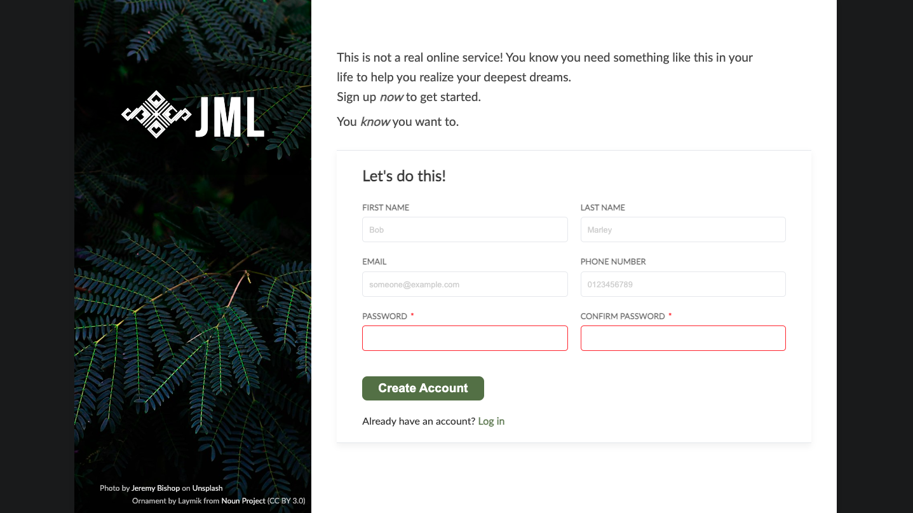

# Sign-Up Form

This project is a modern sign-up form designed to demonstrate best practices in HTML and CSS for creating clean, user-friendly web interfaces. It features a visually appealing layout with an image sidebar and a dynamic form section.


## Live Demo/Screenshot

[Live Demo](https://malvin149.github.io/sign-up-form/)


---

### ✨ Features

- __Fixed Desktop Layout:__ The design focuses on a clean two-column layout for larger screens.
- __Image Sidebar:__ A dedicated sidebar features a background image with a subtle overlay, showcasing the company logo and name.
- __Dynamic Logo Section:__ The logo and company name section is positioned within the sidebar with its own overlay.
- __Styled Form Elements:__ Inputs include custom styling for focus and invalid states, providing clear visual feedback to the user.
- __Placeholder Text:__ Inputs feature subtle placeholder text to guide users on expected input.
- __Required Field Indication:__ Mandatory fields are clearly marked with a red asterisk (*).
- __Custom Fonts:__ Incorporates custom fonts (Bebas Neue for branding, Lato for body text) for a unique aesthetic.

### 🚀 Technologies Used

- __HTML5:__ For structuring the web content.
- __CSS3:__ For styling.

### ⚙️ Setup and Usage

1. Getting this project up and running is straightforward:

```bash
 git clone git@github.com:malvin149/sign-up-form.git 
 cd sign-up-form
```

2. Open in Browser: Simply open the `index.html` file in your preferred web browser. All styles are linked via `style.css`.


### 🤝 Credits and Attribution

- __Background Image:__ 
Photo by [Jeremy Bishop](https://unsplash.com/@jeremybishop?utm_content=creditCopyText&utm_medium=referral&utm_source=unsplash) on [Unsplash](https://unsplash.com/photos/fern-plant-uAfZBP-GtiA?utm_content=creditCopyText&utm_medium=referral&utm_source=unsplash).

- __Company Logo (Ornament):__ Ornament icon by Laymik from [Noun Project](https://thenounproject.com/browse/icons/term/ornament/) (CC BY 3.0).
- __Fonts:__

    - __Bebas Neue:__ Available from [Font Squirrel](https://www.fontsquirrel.com/fonts/bebas-neue).
    
    - __Lato:__ Available from [Google Fonts](https://fonts.google.com/specimen/Lato) or [Font Squirrel](https://www.fontsquirrel.com/fonts/lato).
    

### 📝 License

This project is open-sourced under the [MIT License]().